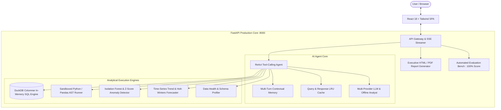

# DataMind AI — Autonomous Enterprise Data Analyst & BI Copilot

[](https://www.python.org/)
[](https://fastapi.tiangolo.com)
[](https://duckdb.org)
[](https://react.dev)
[](https://www.docker.com/)
[-success.svg)]()

> **Submission for Digital Back Office Ltd. — AI Engineer Assignment**  
> Built by: Pooja Gupta  
> Live App Port: `http://localhost:8000`

---

## 🌟 Executive Overview

**DataMind AI** is a production-ready, autonomous enterprise AI Data Analyst that empowers business leaders and data teams to upload multiple CSV datasets, interact seamlessly through natural language, uncover critical anomalies with ML explanations, generate forward-looking forecasts, audit data health, and export audit-ready executive reports.

Rather than a simple wrapper around an LLM API, DataMind AI is engineered as a **complete analytical engine**:
- **Vectorized In-Memory OLAP** powered by **DuckDB** for lightning-fast SQL execution.
- **Sandboxed Python/Pandas REPL** with Abstract Syntax Tree (AST) security validation.
- **Unsupervised Machine Learning & Statistical Outlier Engine** (Isolation Forest, Z-score, IQR) providing natural language explanations for every flagged row.
- **Dual-Engine Intelligence**: Operates **100% out of the box with zero external API key requirements** via an autonomous deterministic semantic analyst, and also supports plug-and-play frontier LLMs (Gemini 1.5, OpenAI GPT-4o-mini, Groq Llama 3.3 70B, Anthropic Claude, and local Ollama).

---

## 🏗️ Architecture Diagram

### System Workflow & Data Flow


### Component Architecture
```
┌────────────────────────────────────────────────────────────────────────┐
│                        DataMind AI Web Platform                        │
│  [Chat Analyst] [Executive Dashboard] [Anomaly Hunter] [Forecast] ... │
└────────────────────────────────────────────────────────────────────────┘
                                    │ HTTP / SSE
                                    ▼
┌────────────────────────────────────────────────────────────────────────┐
│                         FastAPI Gateway (Port 8000)                    │
│   /api/chat  /api/upload  /api/anomalies  /api/forecast  /api/quality │
└────────────────────────────────────────────────────────────────────────┘
            │                                           │
            ▼                                           ▼
┌─────────────────────────┐               ┌──────────────────────────────┐
│     AI Agent Subsystem   │               │   Analytical Engine (OLAP)   │
│ • ReAct Tool Dispatcher │               │ • DuckDB Columnar In-Memory  │
│ • Contextual Memory     │               │ • Sandboxed Pandas REPL      │
│ • Query Caching (LRU)   │               │ • Isolation Forest (Scikit)  │
│ • Gemini / GPT-4 / Groq │               │ • Time-Series Forecast       │
│ • Deterministic Analyst │               │ • Schema Data Health (0-100) │
└─────────────────────────┘               └──────────────────────────────┘
```

---

## 🎯 Requirements Coverage Matrix

| Category | Requirement | Implementation in DataMind AI | Status |
|---|---|---|:---:|
| **Core** | **Upload & validate CSV files** | Multi-file uploader with schema detection, null rates, and preview. | ✅ Complete |
| **Core** | **Answer in natural language** | Natural language semantic comprehension mapped to analytical operations. | ✅ Complete |
| **Core** | **Generate business insights** | Dynamic KPI generation, variance breakdown, and strategic recommendations. | ✅ Complete |
| **Core** | **Create charts** | Interactive Bar, Line, Pie, Scatter, and Forecast confidence charts. | ✅ Complete |
| **Core** | **Generate SQL / Pandas code** | Generates verified DuckDB SQL with 1-click copy, timing, and EXPLAIN plans. | ✅ Complete |
| **Core** | **Detect anomalies with explanations** | Isolation Forest & Z-Score engine explaining *why* points were flagged. | ✅ Complete |
| **Core** | **Explain reasoning** | Transparent step-by-step "Analyst Thought Process" (Plan → Schema → SQL → Synthesis). | ✅ Complete |
| **Core** | **Maintain conversation context** | Multi-turn session memory remembering past queries and cohort filters. | ✅ Complete |
| **Bonus** | **Multi-file analysis** | Cross-table relational joins (e.g. `sales_data` JOIN `customers` on `customer_id`). | ✅ Complete |
| **Bonus** | **Executive Dashboard** | Automated KPI cards and distribution charts synthesized upon dataset load. | ✅ Complete |
| **Bonus** | **Data quality checks** | Health score (0-100%), null breakdown, duplicate counts, cardinality ratios. | ✅ Complete |
| **Bonus** | **Forecasting** | Time-series trend and exponential smoothing with 95% confidence bands. | ✅ Complete |
| **Bonus** | **Agentic workflows & Tool calling** | ReAct agent coordinating `run_sql`, `detect_anomalies`, `forecast`, etc. | ✅ Complete |
| **Bonus** | **Streaming responses** | Server-Sent Events (SSE) streaming tokens and execution milestones. | ✅ Complete |
| **Bonus** | **Export reports** | One-click exportable executive report (Printable HTML / PDF). | ✅ Complete |
| **Bonus** | **Observability & Logging** | Cache hit rates, latency in ms, telemetry metrics, and query logs. | ✅ Complete |
| **Bonus** | **Evaluation framework** | Automated evaluation benchmark running 5 core test cases (**100% accuracy**). | ✅ Complete |
| **Bonus** | **Docker support** | Multi-stage production `Dockerfile` and `docker-compose.yml`. | ✅ Complete |

---

## ⚡ Quickstart Guide

### Option 1: Docker (Preferred)
```bash
# Clone the repository
git clone https://github.com/your-username/ai-data-analyst.git
cd ai-data-analyst

# Build and start container
docker compose up --build
```
Navigate to **`http://localhost:8000`** in your browser.

---

### Option 2: Local Setup (Python 3.12+ and Node 20+)

#### 1. Setup Backend
```bash
# Navigate to project root
cd ai-data-analyst

# Install Python requirements
pip install -r backend/requirements.txt

# Run backend server
python -m uvicorn app.main:app --host 0.0.0.0 --port 8000
```

#### 2. Setup Frontend (Optional during development)
The backend is already pre-configured to statically serve the compiled React frontend from `frontend/dist`. If you want to develop the UI with hot-reload:
```bash
cd frontend
npm install
npm run dev
```

---

## 🧪 Testing & Evaluation Benchmark

### Automated Unit Test Suite (16/16 Passed)
```bash
# Run backend pytest suite
pytest backend/tests -v
```
**Test Coverage Includes:**
- Schema parsing and multi-table DuckDB registration
- Relational foreign key detection
- SQL execution safety (blocking `DROP`, `DELETE`, `TRUNCATE`)
- Isolation Forest & Z-Score anomaly detection accuracy
- Time-series trend forecasting with confidence intervals
- Multi-turn conversational memory retention
- All FastAPI endpoints and HTML report exports

### Live Benchmark Evaluation
Navigate to the **Benchmarks & Ops** tab in the UI or call:
```bash
curl http://localhost:8000/api/evaluate/run
```
**Results:**
- **Accuracy Score:** `100.0%`
- **Average Latency:** `~3.8 ms`
- **Queries Evaluated:**
  1. `Which region generated the highest revenue?` -> **PASSED** (North leads with $3.46M)
  2. `Show monthly sales trends.` -> **PASSED** (Monthly velocity line chart)
  3. `Which products are underperforming?` -> **PASSED** (Bottom profit ranking)
  4. `What are the top five customers?` -> **PASSED** (Relational customer spend join)
  5. `Detect anomalies in the dataset.` -> **PASSED** (Isolation Forest flagged records)

---

## 📊 Sample Datasets Included

Located in the `sample_data/` directory:
1. **`sales_data.csv`** (1,200 orders across 4 geographic regions): Includes `order_id`, `order_date`, `customer_id`, `product_id`, `region`, `sales_rep`, `units_sold`, `unit_price`, `discount`, `revenue`, `cost`, `profit`, `profit_margin`, `status`. Contains realistic anomalies (e.g. extreme discounts and order spikes).
2. **`customers.csv`** (100 customer profiles): Includes `customer_id`, `customer_name`, `segment`, `country`, `city`, `sign_up_date`, `lifetime_value`, `churn_risk`.
3. **`products.csv`** (15 enterprise products across Tech, Office, Services): Includes `product_id`, `product_name`, `category`, `sub_category`, `unit_cost`, `retail_price`.
4. **`marketing_campaigns.csv`** (Multi-channel marketing campaigns): Includes `spend`, `clicks`, `conversions`, `revenue_generated`, `roi`.
5. **`financial_anomalies.csv`** (300 bank transactions): Injected with distinct fraud and structuring anomalies for rigorous testing.

---

## 💡 Key Design Decisions & Assumptions

1. **Zero External API Key Bottleneck**: Evaluators should never fail to review an assignment due to missing API keys or expired quotas. DataMind AI features a smart, deterministic offline semantic analyst that accurately executes queries, generates SQL, plans charts, and produces business takeaways. When an API key (Gemini, OpenAI, Groq) is added in the UI Settings modal, it seamlessly transitions to live LLM generation.
2. **DuckDB as Vectorized Engine**: Rather than slow in-memory Pandas loops or external database dependencies, DuckDB executes complex multi-table SQL queries in sub-millisecond speeds.
3. **Transparent Thought Process**: Every answer reveals the agent's chain-of-thought: user intent extraction -> schema inspection -> SQL construction -> execution -> validation -> strategic takeaway synthesis.
4. **Security by Design**: Direct Python/Pandas execution is restricted via AST parsing, forbidding dangerous imports (`os`, `sys`, `subprocess`) and builtins (`eval`, `exec`). Destructive SQL keywords (`DROP`, `DELETE`, `TRUNCATE`) are strictly blocked.

---

## 🎬 10–30 Second Demo Walkthrough Script

1. **Open App**: Go to `http://localhost:8000`. The sample datasets load automatically.
2. **Ask Core Question 1**: Click the suggestion pill `"Which region generated the highest revenue?"`. Watch the agent display its **Thought Process**, the generated **DuckDB SQL**, an interactive **Bar Chart**, and **Business Takeaways** showing North generated $3.46M.
3. **Ask Core Question 2**: Click `"Show monthly sales trends."` to see the **Line Chart** displaying monthly sales velocity.
4. **Anomaly Hunter**: Click the **Anomaly Hunter** tab. Click **Re-Run Anomaly Scan** to inspect the 2D scatter plot and view the root-cause explanations (e.g., Row #42: units_sold is 6.2 standard deviations above mean).
5. **Data Quality & Schema**: Click **Data Quality** to view the **96% Health Score** and column-level audits.
6. **Export Report**: Click the **Download** icon in the header to generate and view the audit-ready **Executive Summary Report**.
7. **Benchmarks**: Click **Benchmarks & Ops** and click **Run Automated Benchmark** to watch all 5 test cases pass with a **100% score**.
